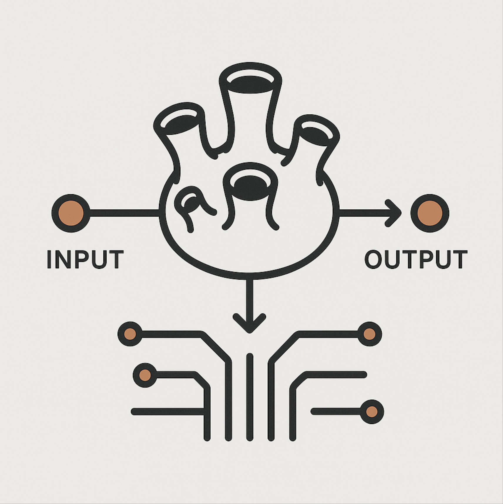

<div align="center">
  
</div>

# Barnacle 🦀

[](https://crates.io/crates/barnacle-rs)
[](https://docs.rs/barnacle-rs)
[](https://github.com/zyphelabs/barnacle-rs/blob/main/LICENSE)
[](https://www.rust-lang.org)

Rate limiting and API key validation middleware for Axum with Redis backend.

[Repository](https://github.com/zyphelabs/barnacle-rs) | [Documentation](https://docs.rs/barnacle-rs) | [Crates.io](https://crates.io/crates/barnacle-rs)

## Features

- **Rate Limiting**: IP-based or custom key-based rate limiting
- **API Key Validation**: Validate `x-api-key` header with per-key limits
- **Request Modification**: Modify request parts after validation but before processing
- **Redis Backend**: Distributed rate limiting with Redis
- **Axum Middleware**: Drop-in middleware for Axum applications
- **Reset on Success**: Optional rate limit reset on successful operations
- **Extensible Design**: Custom key stores and rate limiting strategies
- **Atomic counters**: A single Lua script per request, no over-admission under concurrency
- **Configurable buckets**: Per path, per route template, or shared across routes
- **Proxy-aware client IPs**: Trusted proxy list for applications behind a load balancer
- **Brute-force protection**: Failed API key validations limited per client IP

## Examples

### Quick Start

```toml
[dependencies]
barnacle-rs = "0.4"
axum = "0.8"
tokio = { version = "1", features = ["full"] }
```

### Basic Rate Limiting

```rust
use barnacle_rs::{RedisBarnacleStore, BarnacleConfig};
use axum::{Router, routing::get};

#[tokio::main]
async fn main() -> Result<(), Box<dyn std::error::Error>> {
    let store = RedisBarnacleStore::from_url("redis://127.0.0.1:6379").await?;
    let config = BarnacleConfig {
        max_requests: 10,
        window: std::time::Duration::from_secs(60),
        reset_on_success: barnacle_rs::ResetOnSuccess::Not,
    };
    let layer = barnacle_rs::BarnacleLayer::builder()
        .with_store(store)
        .with_config(config)
        .build();
    let app = Router::new()
        .route("/api/data", get(handler))
        .layer(layer);
    let listener = tokio::net::TcpListener::bind("0.0.0.0:3000").await?;
    axum::serve(listener, app).await?;
    Ok(())
}

async fn handler() -> &'static str {
    "Hello, World!"
}
```

### API Key Validation (Stateless)

```rust
use barnacle_rs::{BarnacleLayer, BarnacleConfig, RedisBarnacleStore, BarnacleError};
use axum::{Router, routing::get};
use std::sync::Arc;
use axum::http::request::Parts;

#[tokio::main]
async fn main() -> Result<(), Box<dyn std::error::Error>> {
    let store = RedisBarnacleStore::from_url("redis://127.0.0.1:6379").await?;
    let config = BarnacleConfig::default();
    let api_key_validator = |api_key: String, _api_key_config: ApiKeyConfig, _parts: Arc<Parts>, _state: ()| async move {
        if api_key.is_empty() {
            Err(BarnacleError::ApiKeyMissing)
        } else if api_key != "test-key" {
            Err(BarnacleError::invalid_api_key(api_key))
        } else {
            Ok(())
        }
    };
    let layer: BarnacleLayer<(), RedisBarnacleStore, (), BarnacleError, _> = BarnacleLayer::builder()
        .with_store(store)
        .with_config(config)
        .with_api_key_validator(api_key_validator)
        .build()
        .unwrap();
    let app = Router::new()
        .route("/api/protected", get(handler))
        .layer(layer);
    let listener = tokio::net::TcpListener::bind("0.0.0.0:3000").await?;
    axum::serve(listener, app).await?;
    Ok(())
}

async fn handler() -> &'static str {
    "Protected endpoint"
}
```

### API Key Validation (With state)

```rust
use barnacle_rs::{BarnacleLayer, BarnacleConfig, RedisBarnacleStore, BarnacleError};
use axum::{Router, routing::get};
use std::sync::Arc;
use axum::http::request::Parts;

#[derive(Clone)]
struct MyState {
    allowed_keys: Vec<String>,
}

#[tokio::main]
async fn main() -> Result<(), Box<dyn std::error::Error>> {
    let store = RedisBarnacleStore::from_url("redis://127.0.0.1:6379").await?;
    let config = BarnacleConfig::default();
    let state = MyState { allowed_keys: vec!["my-secret-key".to_string()] };
    let api_key_validator = |api_key: String, _api_key_config: BarnacleConfig, _parts: Arc<Parts>, state: MyState| async move {
        let allowed = state.allowed_keys.contains(&api_key);
        if allowed {
            Ok(())
        } else {
            Err(BarnacleError::invalid_api_key(api_key))
        }
    };
    let layer: BarnacleLayer<(), RedisBarnacleStore, MyState, BarnacleError, _> = BarnacleLayer::builder()
        .with_store(store)
        .with_config(config)
        .with_state(state)
        .with_api_key_validator(api_key_validator)
        .build()
        .unwrap();
    let app = Router::new()
        .route("/api/protected", get(handler))
        .layer(layer);
    let listener = tokio::net::TcpListener::bind("0.0.0.0:3000").await?;
    axum::serve(listener, app).await?;
    Ok(())
}

async fn handler() -> &'static str {
    "Protected endpoint with state"
}
```

### Custom Key Extraction (e.g., Email)

```rust
use barnacle_rs::{KeyExtractable, BarnacleKey};
use axum::http::request::Parts;

#[derive(serde::Deserialize)]
struct LoginRequest {
    email: String,
    password: String,
}
impl KeyExtractable for LoginRequest {
    fn extract_key(&self) -> BarnacleKey {
        BarnacleKey::Email(self.email.clone())
    }
}
let layer = barnacle_rs::BarnacleLayer::builder()
    .with_store(store)
    .with_config(config)
    .build();
```

### Rate Limiting Strategies

#### IP-based (default)

```rust
let layer = barnacle_rs::BarnacleLayer::builder()
    .with_store(store)
    .with_config(config)
    .build();
```

#### API Key-based

```rust
let layer = barnacle_rs::BarnacleLayer::builder()
    .with_store(api_key_store)
    .with_config(config)
    .build();
```

#### Custom Key (e.g., email)

```rust
use barnacle_rs::{KeyExtractable, BarnacleKey};

#[derive(serde::Deserialize)]
struct LoginRequest {
    email: String,
    password: String,
}

impl KeyExtractable for LoginRequest {
    fn extract_key(&self) -> BarnacleKey {
        BarnacleKey::Email(self.email.clone())
    }

}

let layer = barnacle_rs::BarnacleLayer::builder()
    .with_store(store)
    .with_config(config)
    .build();
```

### Example: No Validator (API key validation disabled)

```rust
use barnacle_rs::{BarnacleLayer, RedisBarnacleStore, BarnacleError};

let middleware: BarnacleLayer<(), RedisBarnacleStore, (), BarnacleError, ()> = BarnacleLayer::builder()
    .with_store(store)
    .with_config(config)
    .build()
    .unwrap();
```

### Example: With Validator (API key validation enabled)

```rust
use barnacle_rs::{BarnacleLayer, RedisBarnacleStore, BarnacleError};
use std::sync::Arc;
use axum::http::request::Parts;

let api_key_validator = |api_key: String, api_key_config: ApiKeyConfig, parts: Arc<Parts>, state: ()| async move {
    if api_key == "test-key" {
        Ok(())
    } else {
        Err(BarnacleError::invalid_api_key(api_key))
    }
};

let middleware: BarnacleLayer<(), RedisBarnacleStore, (), BarnacleError, _> = BarnacleLayer::builder()
    .with_store(store)
    .with_config(config)
    .with_api_key_validator(api_key_validator)
    .with_state(())
    .build()
    .unwrap();
```

**Note:**
- The validator closure must take owned arguments: `(String, ApiKeyConfig, Arc<Parts>, State)`.
- If you do not provide a validator, use `()` for the last type parameter.
- If you provide a validator, use `_` for the last type parameter to let Rust infer the closure type.
- If you provide a request modifier, use `_` for the last two type parameters to let Rust infer the types.

### Request Modification

Modify request parts after validation but before the request reaches your handler:

```rust
use barnacle_rs::{BarnacleLayer, BarnacleConfig, RedisBarnacleStore, BarnacleError, ApiKeyConfig};
use axum::{Router, routing::get};
use axum::http::request::Parts;
use std::sync::Arc;

#[tokio::main]
async fn main() -> Result<(), Box<dyn std::error::Error>> {
    let store = RedisBarnacleStore::from_url("redis://127.0.0.1:6379").await?;
    let config = BarnacleConfig::default();

    // Optional API key validator
    let api_key_validator = |api_key: String, _config: ApiKeyConfig, _parts: Arc<Parts>, _state: ()| async move {
        if api_key == "valid-key" {
            Ok(())
        } else {
            Err(BarnacleError::invalid_api_key(api_key))
        }
    };

    // Request modifier that adds a custom header after validation
    let request_modifier = |mut parts: Parts, _state: ()| async move {
        parts.headers.insert(
            "x-request-modified",
            "true".parse().unwrap()
        );
        Ok(parts)
    };

    let layer: BarnacleLayer<(), RedisBarnacleStore, (), BarnacleError, _, _> = BarnacleLayer::builder()
        .with_store(store)
        .with_config(config)
        .with_api_key_validator(api_key_validator) // Optional: only if you want validation
        .with_request_modifier(request_modifier)
        .build()
        .unwrap();

    let app = Router::new()
        .route("/api/modified", get(handler))
        .layer(layer);

    let listener = tokio::net::TcpListener::bind("0.0.0.0:3000").await?;
    axum::serve(listener, app).await?;
    Ok(())
}

async fn handler() -> &'static str {
    "Request was modified by Barnacle!"
}
```

**Note:**
- The modifier closure receives `(Parts, State)` and returns `Result<Parts, Error>`.
- Modifications happen after successful validation but before request reconstruction.
- Use `_` for the modifier type parameter to let Rust infer the closure type.
- The modifier has access to all request parts (headers, extensions, URI, method, etc.).
- If you don't provide a modifier, use `()` for the last type parameter.

### Running Examples

```bash
# Run examples
cargo run --example basic
cargo run --example api_key_redis_test
cargo run --example custom_validator_example
cargo run --example error_integration
cargo run --example api_key_test
```

### Error Integration, Custom Validator & Request Modification

For error handling, custom validator implementation, and request modification, see:

- `examples/error_integration.rs`
- `examples/custom_validator_example.rs`

## Configuration

```rust
let config = BarnacleConfig {
    max_requests: 100,                              // Requests per window
    window: Duration::from_secs(3600),              // Time window
    reset_on_success: ResetOnSuccess::Yes(          // Reset on success
        Some(vec![200, 201])                        // Status codes to reset on
    ),
};
```

## Layer Options

```rust
use barnacle_rs::{ClientIpStrategy, RateLimitScope, StoreFailurePolicy};

let layer: BarnacleLayer<(), RedisBarnacleStore, (), BarnacleError, _> = BarnacleLayer::builder()
    .with_store(store)
    .with_config(config)
    .with_state(())
    .with_api_key_validator(api_key_validator)
    // One bucket per route template (`/users/{id}`) instead of per concrete path
    .with_scope(RateLimitScope::Route)
    // Behind a load balancer: read the client from X-Forwarded-For, trusting only these hops
    .with_client_ip_strategy(ClientIpStrategy::trusted_proxies(["10.0.0.0/8"])?)
    // At most 10 failed key validations per client IP every 10 minutes
    .with_failed_validation_limit(BarnacleConfig {
        max_requests: 10,
        window: Duration::from_secs(600),
        reset_on_success: ResetOnSuccess::Not,
    })
    // Let requests through when Redis is down or slower than 200ms
    .with_store_failure_policy(StoreFailurePolicy::FailOpen)
    .with_store_timeout(Duration::from_millis(200))
    // Maximum body size buffered to read a payload key (413 above it)
    .with_max_body_size(64 * 1024)
    .build()?;
```

| Option | Default | Notes |
| --- | --- | --- |
| `with_scope` | `RateLimitScope::Path` | `Path`: one bucket per concrete path and method. `Route`: per route template (axum `MatchedPath`, needs `route_layer` or a layer on the route). `Named(name)`: one bucket per key for every route of the layer; layers with the same name share it. |
| `with_client_ip_strategy` | `ClientIpStrategy::Legacy` | `Legacy`: peer address, then the first `X-Forwarded-For` entry, then `X-Real-IP` (behind a proxy every client shares the proxy IP). `PeerOnly`: peer address only. `TrustedProxies`: the first address, right to left, that is not a trusted proxy. |
| `with_failed_validation_limit` | off | Counts validator failures for requests carrying a key, per client IP, in a bucket shared by all layers (`FAILED_VALIDATION_SCOPE`). Over the limit the validator is not called and the response is 429. |
| `with_store_failure_policy` | `FailClosed` | `FailClosed` answers 503 when the store fails; `FailOpen` lets the request through without rate limiting. |
| `with_store_timeout` | none | Store operations slower than this count as failures. |
| `with_max_body_size` | none | Only applies when the key is read from the payload. Otherwise the body is streamed to the handler without being buffered, and its size limit is up to the application. |

The peer address is only available when the server is started with
`into_make_service_with_connect_info::<SocketAddr>()`.

Inside your own `KeyExtractable` implementations, use `barnacle_rs::client_ip(&parts)` or
`barnacle_rs::client_ip_key(&parts)` to get the client IP with the layer's strategy.

Rate limited responses carry `Retry-After`, `X-RateLimit-Limit`, `X-RateLimit-Remaining` and
`X-RateLimit-Reset`, even when the error is converted into a custom error type that doesn't
set them.

### Redis pool

Without timeouts, a slow or unreachable Redis makes every request wait for a connection.
`RedisBarnacleStore::from_url_with_options` sets them (500ms each by default):

```rust
let store = RedisBarnacleStore::from_url_with_options(
    "redis://127.0.0.1:6379",
    RedisPoolOptions { max_size: Some(32), ..Default::default() },
)?;
```

## Automatic Route-Based Rate Limiting

Barnacle automatically includes route information (path and method) in Redis keys, providing per-endpoint rate limiting without any additional configuration:

**Redis Key Format:**

```
barnacle:email:user@example.com:POST:/auth/login
barnacle:email:user@example.com:POST:/auth/start-reset
barnacle:api_keys:<sha256 of the key>:GET:/api/data
barnacle:ip:192.168.1.1:POST:/api/submit
```

API keys are stored as their SHA-256 hash and are redacted in logs and in `BarnacleKey`'s
`Debug` output.

This means:

- ✅ Same email can have different rate limits per endpoint
- ✅ No need to modify `KeyExtractable` implementations
- ✅ Automatic separation of rate limits by route
- ✅ Backward compatible with existing code

## Redis Setup

Store API keys in Redis (`RedisApiKeyStore`), keyed by the SHA-256 of the key:

```bash
HASH=$(printf '%s' "your-key" | sha256sum | cut -d' ' -f1)

# Valid API key
redis-cli SET "barnacle:api_keys:$HASH" 1

# Per-key rate limit config
redis-cli SET "barnacle:api_keys:config:$HASH" '{"max_requests":100,"window":{"secs":3600,"nanos":0},"reset_on_success":"Not"}'
```

## Upgrading from 0.3

- Redis keys for API keys now contain the SHA-256 of the key: counters and cached keys
  written by 0.3 are ignored (counters restart, cached keys are validated again).
- The `x-api-key` header only identifies the client when an API key validator is
  configured. Before, layers without a validator used any key sent by the client, so a
  new key per request bypassed the limit; those requests are now limited by client IP.
- Counting is a single atomic Lua script, and counters left without expiry are repaired.
- The body is only buffered when the key is read from the payload. A body that can't be
  read now answers 400 instead of being replaced by an empty body.
- `BarnacleError` has a new `PayloadTooLarge` variant (413), and `BarnacleStore` has a new
  `peek` method with a default implementation.
- Rate limited responses carry `Retry-After`; successful responses carry `X-RateLimit-Reset`.
- The service accepts `Request<B>` with `B: HttpBody<Data = Bytes>` (e.g. `axum::body::Body`).

## License

MIT

## Contributing

Contributions are welcome! Please feel free to submit a Pull Request.
