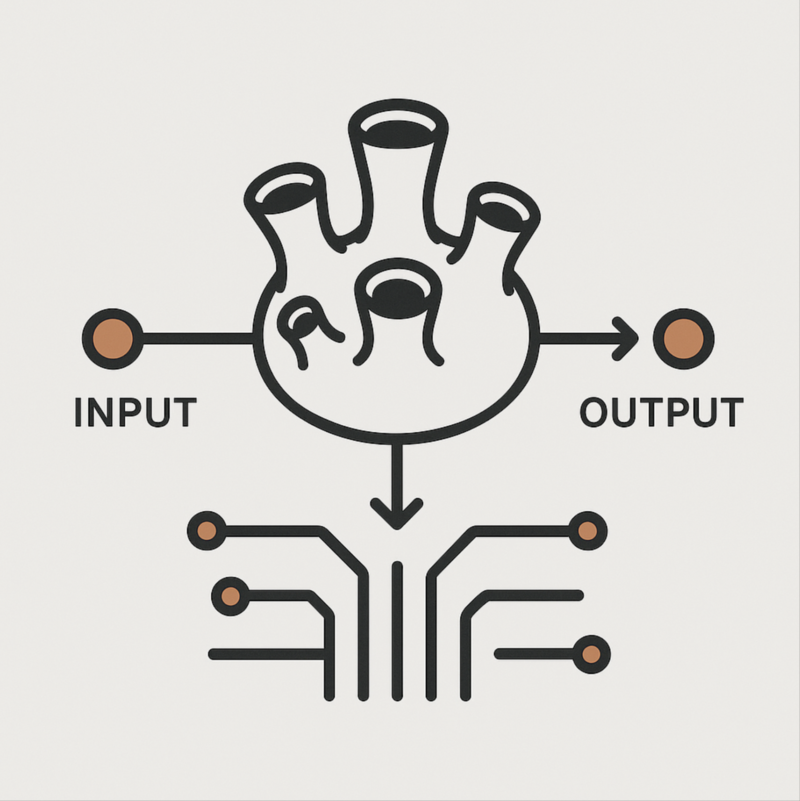

<div align="center">
  
</div>

# Barnacle 🦀

[](https://crates.io/crates/barnacle-rs)
[](https://docs.rs/barnacle-rs)
[](https://github.com/zyphelabs/barnacle-rs/blob/main/LICENSE)
[](https://www.rust-lang.org)

Rate limiting and API key validation middleware for Axum with Redis backend.

[Repository](https://github.com/zyphelabs/barnacle-rs) | [Documentation](https://docs.rs/barnacle-rs) | [Crates.io](https://crates.io/crates/barnacle-rs)

## Features

- **Rate Limiting**: IP-based or custom key-based rate limiting
- **API Key Validation**: Validate `x-api-key` header with per-key limits
- **Request Modification**: Modify request parts after validation but before processing
- **Redis Backend**: Distributed rate limiting with Redis
- **Axum Middleware**: Drop-in middleware for Axum applications
- **Reset on Success**: Optional rate limit reset on successful operations
- **Extensible Design**: Custom key stores and rate limiting strategies
- **Atomic counters**: A single Lua script per request, no over-admission under concurrency
- **Configurable buckets**: Per path, per route template, or shared across routes
- **Proxy-aware client IPs**: Trusted proxy list for applications behind a load balancer
- **Brute-force protection**: Failed API key validations limited per client IP
- **Principal identification**: Count requests per authenticated principal, with limits per tier
- **Multiple atomic limits**: Burst and sustained, global and per route, all or nothing
- **Shadow mode**: Measure limits (hook and logs) before enforcing them

## Examples

### Quick Start

```toml
[dependencies]
barnacle-rs = "0.5"
axum = "0.8"
tokio = { version = "1", features = ["full"] }
```

### Basic Rate Limiting

```rust
use barnacle_rs::{RedisBarnacleStore, BarnacleConfig};
use axum::{Router, routing::get};

#[tokio::main]
async fn main() -> Result<(), Box<dyn std::error::Error>> {
    let store = RedisBarnacleStore::from_url("redis://127.0.0.1:6379")?;
    // 10 requests per minute, without resetting on success
    let config = BarnacleConfig::new(10, std::time::Duration::from_secs(60));
    let layer: barnacle_rs::BarnacleLayer<RedisBarnacleStore> = barnacle_rs::BarnacleLayer::builder()
        .with_store(store)
        .with_config(config)
        .build()?;
    let app = Router::new()
        .route("/api/data", get(handler))
        .layer(layer);
    let listener = tokio::net::TcpListener::bind("0.0.0.0:3000").await?;
    axum::serve(listener, app).await?;
    Ok(())
}

async fn handler() -> &'static str {
    "Hello, World!"
}
```

### API Key Validation (Stateless)

```rust
use barnacle_rs::{ApiKeyConfig, BarnacleLayer, BarnacleConfig, RedisBarnacleStore, BarnacleError};
use axum::{Router, routing::get};
use std::sync::Arc;
use axum::http::request::Parts;

#[tokio::main]
async fn main() -> Result<(), Box<dyn std::error::Error>> {
    let store = RedisBarnacleStore::from_url("redis://127.0.0.1:6379")?;
    let config = BarnacleConfig::default();
    let api_key_validator = |api_key: String, _api_key_config: ApiKeyConfig, _parts: Arc<Parts>, _state: ()| async move {
        if api_key.is_empty() {
            Err(BarnacleError::ApiKeyMissing)
        } else if api_key != "test-key" {
            Err(BarnacleError::invalid_api_key(api_key))
        } else {
            Ok(())
        }
    };
    let layer: BarnacleLayer<RedisBarnacleStore> = BarnacleLayer::builder()
        .with_store(store)
        .with_config(config)
        .with_api_key_validator(api_key_validator)
        .build()
        .unwrap();
    let app = Router::new()
        .route("/api/protected", get(handler))
        .layer(layer);
    let listener = tokio::net::TcpListener::bind("0.0.0.0:3000").await?;
    axum::serve(listener, app).await?;
    Ok(())
}

async fn handler() -> &'static str {
    "Protected endpoint"
}
```

### API Key Validation (With state)

```rust
use barnacle_rs::{ApiKeyConfig, BarnacleLayer, BarnacleConfig, RedisBarnacleStore, BarnacleError};
use axum::{Router, routing::get};
use std::sync::Arc;
use axum::http::request::Parts;

#[derive(Clone)]
struct MyState {
    allowed_keys: Vec<String>,
}

#[tokio::main]
async fn main() -> Result<(), Box<dyn std::error::Error>> {
    let store = RedisBarnacleStore::from_url("redis://127.0.0.1:6379")?;
    let config = BarnacleConfig::default();
    let state = MyState { allowed_keys: vec!["my-secret-key".to_string()] };
    let api_key_validator = |api_key: String, _api_key_config: ApiKeyConfig, _parts: Arc<Parts>, state: MyState| async move {
        let allowed = state.allowed_keys.contains(&api_key);
        if allowed {
            Ok(())
        } else {
            Err(BarnacleError::invalid_api_key(api_key))
        }
    };
    let layer: BarnacleLayer<RedisBarnacleStore, MyState> = BarnacleLayer::builder()
        .with_store(store)
        .with_config(config)
        .with_state(state)
        .with_api_key_validator(api_key_validator)
        .build()
        .unwrap();
    let app = Router::new()
        .route("/api/protected", get(handler))
        .layer(layer);
    let listener = tokio::net::TcpListener::bind("0.0.0.0:3000").await?;
    axum::serve(listener, app).await?;
    Ok(())
}

async fn handler() -> &'static str {
    "Protected endpoint with state"
}
```

### Custom Key Extraction (e.g., Email)

```rust
use barnacle_rs::{BarnacleKey, BarnacleLayer, KeyExtractable, RedisBarnacleStore};
use axum::http::request::Parts;

#[derive(serde::Deserialize)]
struct LoginRequest {
    email: String,
    password: String,
}

impl KeyExtractable for LoginRequest {
    fn extract_key(&self, _parts: &Parts) -> BarnacleKey {
        BarnacleKey::Email(self.email.clone())
    }
}

let layer: BarnacleLayer<RedisBarnacleStore> = BarnacleLayer::builder()
    .with_store(store)
    .with_config(config)
    // Read the key from the JSON body; falls back to the client IP when it doesn't parse
    .with_payload_key::<LoginRequest>()
    .build()?;
```

### Which key a request is counted for

1. The identity returned by the identifier, when one is configured and resolves the request
   (see [Identifying requests by principal](#identifying-requests-by-principal)).
2. The API key, when a validator is configured and accepted it.
3. The payload key, when `with_payload_key` is set and the body parses.
4. The client IP, resolved with the layer's `ClientIpStrategy`.

### Example: With Validator (API key validation enabled)

```rust
use barnacle_rs::{ApiKeyConfig, BarnacleLayer, RedisBarnacleStore, BarnacleError};
use std::sync::Arc;
use axum::http::request::Parts;

let api_key_validator = |api_key: String, api_key_config: ApiKeyConfig, parts: Arc<Parts>, state: ()| async move {
    if api_key == "test-key" {
        Ok(())
    } else {
        Err(BarnacleError::invalid_api_key(api_key))
    }
};

let middleware: BarnacleLayer<RedisBarnacleStore> = BarnacleLayer::builder()
    .with_store(store)
    .with_config(config)
    .with_api_key_validator(api_key_validator)
    .build()
    .unwrap();
```

**Note:**
- The validator closure must take owned arguments: `(String, ApiKeyConfig, Arc<Parts>, State)`
  and return a `Result<(), E>` where `E: IntoResponse`; the error is answered as is.
- The layer type is `BarnacleLayer<Store, State>`, `State` defaulting to `()`. A `()` state
  doesn't need `with_state(())`; any other state must be set, or `build` fails with
  `MissingState`.

### Request Modification

Modify request parts after validation but before the request reaches your handler:

```rust
use barnacle_rs::{BarnacleLayer, BarnacleConfig, RedisBarnacleStore, BarnacleError, ApiKeyConfig};
use axum::{Router, routing::get};
use axum::http::request::Parts;
use std::sync::Arc;

#[tokio::main]
async fn main() -> Result<(), Box<dyn std::error::Error>> {
    let store = RedisBarnacleStore::from_url("redis://127.0.0.1:6379")?;
    let config = BarnacleConfig::default();

    // Optional API key validator
    let api_key_validator = |api_key: String, _config: ApiKeyConfig, _parts: Arc<Parts>, _state: ()| async move {
        if api_key == "valid-key" {
            Ok(())
        } else {
            Err(BarnacleError::invalid_api_key(api_key))
        }
    };

    // Request modifier that adds a custom header after validation
    let request_modifier = |mut parts: Parts, _state: ()| async move {
        parts.headers.insert(
            "x-request-modified",
            "true".parse().unwrap()
        );
        Ok::<_, BarnacleError>(parts)
    };

    let layer: BarnacleLayer<RedisBarnacleStore> = BarnacleLayer::builder()
        .with_store(store)
        .with_config(config)
        .with_api_key_validator(api_key_validator) // Optional: only if you want validation
        .with_request_modifier(request_modifier)
        .build()
        .unwrap();

    let app = Router::new()
        .route("/api/modified", get(handler))
        .layer(layer);

    let listener = tokio::net::TcpListener::bind("0.0.0.0:3000").await?;
    axum::serve(listener, app).await?;
    Ok(())
}

async fn handler() -> &'static str {
    "Request was modified by Barnacle!"
}
```

**Note:**
- The modifier closure receives `(Parts, State)` and returns `Result<Parts, E>` where
  `E: IntoResponse`; name the error type when Rust can't infer it (`Ok::<_, BarnacleError>(parts)`).
- Modifications happen after successful validation but before the request is counted.
- The modifier has access to all request parts (headers, extensions, URI, method, etc.).

### Running Examples

```bash
# Run examples
cargo run --example basic
cargo run --example api_key_redis_test
cargo run --example custom_validator_example
cargo run --example error_integration
cargo run --example api_key_test
```

### Error Integration, Custom Validator & Request Modification

For error handling, custom validator implementation, and request modification, see:

- `examples/error_integration.rs`
- `examples/custom_validator_example.rs`

## Configuration

```rust
let config = BarnacleConfig {
    max_requests: 100,                              // Requests per window
    window: Duration::from_secs(3600),              // Time window
    reset_on_success: ResetOnSuccess::Yes(          // Reset on success
        Some(vec![200, 201])                        // Status codes to reset on
    ),
};

// Same thing without the reset, in one line
let config = BarnacleConfig::new(100, Duration::from_secs(3600));
```

## Layer Options

```rust
use barnacle_rs::{ClientIpStrategy, RateLimitScope, StoreFailurePolicy};

let layer: BarnacleLayer<RedisBarnacleStore> = BarnacleLayer::builder()
    .with_store(store)
    .with_config(config)
    .with_api_key_validator(api_key_validator)
    // One bucket per route template (`/users/{id}`) instead of per concrete path
    .with_scope(RateLimitScope::Route)
    // Behind a load balancer: read the client from X-Forwarded-For, trusting only these hops
    .with_client_ip_strategy(ClientIpStrategy::trusted_proxies(["10.0.0.0/8"])?)
    // At most 10 failed key validations per client IP every 10 minutes
    .with_failed_validation_limit(BarnacleConfig::new(10, Duration::from_secs(600)))
    // Let requests through when Redis is down or slower than 200ms
    .with_store_failure_policy(StoreFailurePolicy::FailOpen)
    .with_store_timeout(Duration::from_millis(200))
    // Maximum body size buffered to read a payload key (413 above it)
    .with_max_body_size(64 * 1024)
    // Answer Barnacle's own errors (429, 503, 413) with the application's error type
    .with_error::<AppError>()
    .build()?;
```

| Option | Default | Notes |
| --- | --- | --- |
| `with_scope` | `RateLimitScope::Path` | `Path`: one bucket per concrete path and method. `Route`: per route template (axum `MatchedPath`, needs `route_layer` or a layer on the route). `Named(name)`: one bucket per key for every route of the layer; layers with the same name share it. |
| `with_client_ip_strategy` | `ClientIpStrategy::Legacy` | `Legacy`: peer address, then the first `X-Forwarded-For` entry, then `X-Real-IP` (behind a proxy every client shares the proxy IP). `PeerOnly`: peer address only. `TrustedProxies`: the first address, right to left, that is not a trusted proxy. |
| `with_failed_validation_limit` | off | Counts authentication failures (validator errors that are 401 or 403) for requests carrying a key, per client IP, in a bucket shared by all layers (`FAILED_VALIDATION_SCOPE`). Over the limit the validator is not called and the response is 429. **Requires a client IP strategy that resolves the real client**, see below. |
| `with_store_failure_policy` | `FailClosed` | `FailClosed` answers 503 when the store fails; `FailOpen` lets the request through without rate limiting. |
| `with_store_timeout` | none | Store operations slower than this count as failures. |
| `with_max_body_size` | none | Only applies when the key is read from the payload. Otherwise the body is streamed to the handler without being buffered, and its size limit is up to the application. |
| `with_limits` | set by `with_config` | Several limits per request, checked all or nothing. See [Multiple limits](#multiple-limits). |
| `with_identifier` / `with_identity_resolver` | off | Key and limits per principal. See [Identifying requests by principal](#identifying-requests-by-principal). |
| `with_mode` | `Mode::Enforce` | `Mode::Shadow` counts and reports but never rejects. See [Shadow mode](#shadow-mode-and-decisions). |
| `on_decision` | off | Hook called with every rate limit decision. |
| `with_payload_key::<T>()` | off | Read the key from the JSON body as `T: KeyExtractable`. |
| `with_error::<E>()` | `BarnacleError` | Response type for Barnacle's own errors (`E: From<BarnacleError> + IntoResponse`). |
| `with_reset_on_success` | set by `with_config` | Reset the request's counters on a successful response. |

The peer address is only available when the server is started with
`into_make_service_with_connect_info::<SocketAddr>()`.

Inside your own `KeyExtractable` implementations, use `barnacle_rs::client_ip(&parts)` or
`barnacle_rs::client_ip_key(&parts)` to get the client IP with the layer's strategy.

### The failed validation limit is per client IP

`with_failed_validation_limit` buckets by client IP, so it is only as precise as the
configured `ClientIpStrategy`:

- Behind a proxy or load balancer, use `ClientIpStrategy::trusted_proxies([...])`.
- When the application is directly exposed, use `ClientIpStrategy::PeerOnly`.
- With the default `Legacy` strategy behind a load balancer **every client is seen as the
  balancer**: they all share one counter, so a single client sending bogus keys can get
  everyone rejected for the length of the window.

When no client IP can be resolved at all (no `ConnectInfo` and no usable header), the
limit is skipped for that request rather than counted in a bucket shared by unrelated
clients; the layer logs it at debug level.

Only authentication failures are counted: a validator that answers 500 or 503 because its
own backend blipped does not lock legitimate clients out, and neither does Barnacle's own
"validator requires state" misconfiguration.

### Resetting a named bucket

A `RateLimitScope::Named` layer (and the failed validation bucket) counts under the scope
name and the `ANY_METHOD` (`"*"`) method instead of a route and method. Build the matching
context with `BarnacleContext::named`, either for `ResetOnSuccess::Multiple` or for a
direct reset:

```rust
use barnacle_rs::{BarnacleContext, BarnacleKey, BarnacleStore, FAILED_VALIDATION_SCOPE};

// The bucket a `RateLimitScope::Named("sdk")` layer counts for this client
store.reset(&BarnacleContext::named(BarnacleKey::Ip("203.0.113.7".into()), "sdk")).await?;

// Clear a client's failed validation counter
store
    .reset(&BarnacleContext::named(
        BarnacleKey::Ip("203.0.113.7".into()),
        FAILED_VALIDATION_SCOPE,
    ))
    .await?;
```

Rate limited responses carry `Retry-After`, `X-RateLimit-Limit`, `X-RateLimit-Remaining` and
`X-RateLimit-Reset`, even when the error is converted into a custom error type that doesn't
set them.

### Redis pool

Without timeouts, a slow or unreachable Redis makes every request wait for a connection.
Every constructor that takes a URL (`RedisBarnacleStore::from_url`, `with_pool_config`,
`RedisApiKeyStore::from_url`) applies the default `RedisPoolOptions`: 5s to open a
connection, 2s to wait for a free one, 2s to check one before reusing it. Opening a
connection is the slowest step (DNS, TCP, TLS, AUTH), so the create timeout is the one
to keep generous: with the default `FailClosed` policy, a timeout there turns a healthy
but distant Redis into a 503.

```rust
let store = RedisBarnacleStore::from_url_with_options(
    "redis://127.0.0.1:6379",
    RedisPoolOptions { max_size: Some(32), ..Default::default() },
)?;
```

To bound how long a *request* waits, use `with_store_timeout` together with a
`StoreFailurePolicy`, instead of pool timeouts short enough to break connecting.

### fred store

With the `fred` feature, `FredBarnacleStore` counts on a [fred](https://docs.rs/fred) pool
instead of deadpool-redis, with the same keys and scripts: the two stores can share a Redis,
and switching from one to the other keeps the counters. An application that already holds a
fred pool hands it over, and the store opens no connection of its own:

```toml
barnacle-rs = { version = "0.5", default-features = false, features = ["fred"] }
```

```rust
let store = FredBarnacleStore::new(pool.clone()); // a connected `fred::clients::Pool`
let layer: BarnacleLayer<FredBarnacleStore> = BarnacleLayer::builder()
    .with_store(store)
    .build()?;
```

`FredBarnacleStore::from_url` opens a pool of its own with the default `FredPoolOptions`
(4 connections, 5s to connect, 2s per command). A pool handed to `new` keeps its own
settings: give it a command timeout, or use `with_store_timeout`, so a request does not wait
for a reconnection. Without the `redis` feature, `BarnacleLayer` defaults to this store.
There is no fred API key store yet: `RedisApiKeyStore` needs the `redis` feature.

## Identifying requests by principal

An identifier decides who a request is counted for, and with which limits. It reads the
request as the application's authentication middleware left it, so it can bucket every
kind of credential the same way (API keys, bearer tokens, bots, users authenticated with a
JWT) and apply the limits of the credential's tier.

```rust
use barnacle_rs::{BarnacleKey, BarnacleLayer, Identity, Limit, RateLimitScope, RedisBarnacleStore};
use axum::http::request::Parts;

fn tier_limits(principal: &Principal) -> Vec<Limit> {
    match principal.tier {
        Tier::Enterprise => vec![Limit::new(6000, Duration::from_secs(60))],
        Tier::Standard => vec![Limit::new(600, Duration::from_secs(60))],
        // Internal workers are not rate limited
        Tier::Internal => vec![],
    }
}

let layer: BarnacleLayer<RedisBarnacleStore> = BarnacleLayer::builder()
    .with_store(store)
    // Applied to requests the identifier doesn't resolve (e.g. unauthenticated ones)
    .with_config(BarnacleConfig::new(60, Duration::from_secs(60)))
    .with_scope(RateLimitScope::Named("public-api".into()))
    .with_identifier(|parts: &Parts, _state: &()| {
        let principal = parts.extensions.get::<Principal>()?;
        Some(
            Identity::new(BarnacleKey::Custom(principal.credential_id.clone()))
                .with_limits(tier_limits(principal)),
        )
    })
    .build()?;

// The identifier reads what the authentication middleware stored: Barnacle must run
// *inside* it, so add its layer first
let app = Router::new()
    .route("/organizations/{id}", get(handler))
    .route_layer(layer)
    .layer(axum::middleware::from_fn(authenticate));
```

- `None` falls back to Barnacle's own key (validated API key, payload key, client IP) and the
  layer's limits.
- `Identity::new(key)` without `with_limits` applies the layer's limits.
- An empty list of limits counts nothing: the request is not rate limited.
- The identifier runs after the API key validator and the request modifier. For a lookup
  that has to be asynchronous, implement `IdentityResolver<State>` and pass it to
  `with_identity_resolver`.

## Multiple limits

`with_limits` applies several limits to every request, and an identity can bring its own.
They are checked by a single Lua script, all or nothing: when one limit rejects the request,
no counter is incremented, so a request rejected by a route limit doesn't consume the global
one.

```rust
use barnacle_rs::{Limit, RateLimitScope};

let layer: BarnacleLayer<RedisBarnacleStore> = BarnacleLayer::builder()
    .with_store(store)
    .with_limits([
        // Burst and sustained limits per credential, on every route of the layer
        Limit::new(20, Duration::from_secs(1)).with_scope(RateLimitScope::Named("public-api:burst".into())),
        Limit::new(600, Duration::from_secs(60)).with_scope(RateLimitScope::Named("public-api".into())),
        // A stricter limit per route
        Limit::new(6, Duration::from_secs(60)).with_scope(RateLimitScope::Route),
    ])
    .build()?;
```

- A limit without a scope uses the layer's scope (`with_scope`).
- Every limit must count a different bucket, so each needs its own scope: two limits on the
  same scope would share one counter. `Path` and `Route` can't be combined either: on a route
  without parameters they count the same counter. `build` rejects this with
  `DuplicateLimitScope`; limits coming from an identity are checked per request and answered
  with 500 (in shadow mode the request goes through uncounted). To combine a burst
  and a sustained limit on the same routes, give them different `Named` scopes as above.
- The response headers report the strictest limit: over the limit, the exceeded limit that
  resets last (its reset is the `Retry-After`); otherwise the limit with the fewest requests
  left, the one resetting last on a tie.
- `ResetOnSuccess` resets every counter of the request. In shadow mode, a request over a
  limit never resets them, since enforcing would have rejected it.
- Windows are counted in whole seconds, as before.
- The keys of a request are passed to one script, so they must live in the same hash slot:
  Redis Cluster is not supported.

Custom stores get a default `BarnacleStore::increment_all` that handles one limit through
`increment`; to support several limits per request, implement `increment_all` atomically.

## Shadow mode and decisions

`with_mode(Mode::Shadow)` counts requests, adds the rate limit headers and logs, but never
rejects: not over a limit, not when the store fails, not over the failed validation limit.
Counters behave exactly as when enforcing (a request that would be rejected is not counted),
so what shadow mode reports is what enforcing would do. Use it to size new limits on real
traffic before turning them on.

`on_decision` is called with every decision, e.g. to record metrics:

```rust
use barnacle_rs::{DecisionOutcome, Mode, RateLimitDecision};

let layer: BarnacleLayer<RedisBarnacleStore> = BarnacleLayer::builder()
    .with_store(store)
    .with_limits(new_limits)
    .with_mode(Mode::Shadow)
    .on_decision(|decision: &RateLimitDecision| {
        for limit in &decision.limits {
            // e.g. an OpenTelemetry counter
            metrics.record(
                decision.key_hash.as_str(), // never the key itself
                format!("{:?}", limit.scope),
                format!("{:?}", decision.outcome),
                limit.remaining,
            );
        }
    })
    .build()?;
```

| Outcome | Meaning |
| --- | --- |
| `Allowed` | Every limit had room, the request was counted. |
| `Rejected` | A limit was exceeded, the request was answered 429. |
| `WouldReject` | A limit was exceeded in shadow mode, the request went through. |
| `StoreFailure` | The store failed or timed out; the request went through with `FailOpen` or in shadow mode. |

Each decision carries the key kind and a hash of the key (`BarnacleKey::hashed`), the mode,
and per limit its scope, bucket, maximum, window, remaining requests, reset and whether it
was exceeded. The hook runs on the request path: keep it fast. Requests shadow mode lets
through over a limit are also logged at `info` level with the hashed key.

The failed validation limit also reports decisions, keyed by the client IP hash under
`RateLimitScope::Named(FAILED_VALIDATION_SCOPE.into())`. `Allowed` means the authentication
failure was counted within that limit; the validator still returns its authentication
error. A rejected precheck reports `Rejected` or `WouldReject`, and store errors report
`StoreFailure`. Each request produces at most one decision for this limit: a precheck
failure takes precedence over the subsequent increment. If shadow mode or `FailOpen`
lets a valid key proceed after a failed precheck, the regular request limit can produce
another decision for that key.

## Automatic Route-Based Rate Limiting

Barnacle automatically includes route information (path and method) in Redis keys, providing per-endpoint rate limiting without any additional configuration:

**Redis Key Format:**

```
barnacle:email:user@example.com:POST:/auth/login
barnacle:email:user@example.com:POST:/auth/start-reset
barnacle:api_keys:<sha256 of the key>:GET:/api/data
barnacle:ip:192.168.1.1:POST:/api/submit
```

API keys are stored as their SHA-256 hash and are redacted in logs and in `BarnacleKey`'s
`Debug` output.

This means:

- ✅ Same email can have different rate limits per endpoint
- ✅ No need to modify `KeyExtractable` implementations
- ✅ Automatic separation of rate limits by route
- ✅ Backward compatible with existing code

## Redis Setup

Store API keys in Redis (`RedisApiKeyStore`), keyed by the SHA-256 of the key:

```bash
HASH=$(printf '%s' "your-key" | sha256sum | cut -d' ' -f1)

# Valid API key
redis-cli SET "barnacle:api_keys:$HASH" 1

# Per-key rate limit config
redis-cli SET "barnacle:api_keys:config:$HASH" '{"max_requests":100,"window":{"secs":3600,"nanos":0},"reset_on_success":"Not"}'
```

Keys provisioned by 0.3 under their clear text name keep working: the first lookup moves
the entry (and its config) to the hashed name with `RENAME`, which preserves the remaining
TTL, and removes the clear text one. `invalidate_key` and `invalidate_all_keys` delete
both forms.

`ApiKeyStore::validate_key` returns `Result<ApiKeyValidationResult, BarnacleError>`:
answer `Ok(ApiKeyValidationResult::invalid())` only when the key genuinely does not exist,
and `Err(...)` when the lookup itself failed, so an outage is answered with a 5xx instead
of looking like an invalid key (which would be a 401, and would count against the client's
failed validation limit).

## Upgrading from 0.4

- **Breaking**: `BarnacleLayer` has two type parameters, `BarnacleLayer<Store, State = ()>`,
  instead of six. The others moved to builder methods:
  - the payload type `T`: `.with_payload_key::<T>()`;
  - the error type `E`: `.with_error::<E>()` (the validator and the request modifier can
    return any `IntoResponse` error, answered as is);
  - the validator and modifier types `V` and `M` are gone: the closures are boxed.

  So `BarnacleLayer<(), RedisBarnacleStore, (), BarnacleError, _>` becomes
  `BarnacleLayer<RedisBarnacleStore>`, and `BarnacleLayer<LoginRequest, RedisBarnacleStore>`
  becomes `BarnacleLayer<RedisBarnacleStore>` with `.with_payload_key::<LoginRequest>()`.
  A request modifier whose error type was inferred from the layer must name it
  (`Ok::<_, BarnacleError>(parts)`).
- **Breaking**: a validator, modifier or identifier that needs a state and has none is a
  build error (`BarnacleLayerBuilderError::MissingState`) instead of a 500 on every request.
  A `()` state no longer needs `with_state(())`. This removes the `unsafe` code that built
  the `()` state.
- **Breaking**: `ApiKeyConfig.cache_ttl_seconds` is removed (Barnacle never used it), and
  `ApiKeyConfig::custom` only takes the header name.
- **Breaking**: the `RequestModifier` trait is no longer exported; pass a closure to
  `with_request_modifier`.
- `BarnacleStore` has a new `increment_all` method, used for every request. Its default
  implementation handles one limit through `increment`, so custom stores keep working with
  one limit; implement it to use several limits per request.
- Counters keep their Redis keys: a layer with one limit counts in the same keys as 0.4,
  so upgrading doesn't reset them.
- New: identifiers (`with_identifier`, `with_identity_resolver`), multiple limits
  (`with_limits`, `Limit`), shadow mode (`with_mode`), the decision hook (`on_decision`),
  `with_reset_on_success`, `BarnacleKey::kind` and `BarnacleKey::hashed`.

## Upgrading from 0.3

- Redis keys for API keys now contain the SHA-256 of the key. Counters written by 0.3 are
  ignored and restart. Keys the 0.3 way (`SET barnacle:api_keys:<key> 1`) stay valid:
  `RedisApiKeyStore` moves them to the hashed name on first lookup, keeping the remaining
  TTL, and deletes the clear text entry.
- **Breaking**: `ApiKeyStore::validate_key` now returns
  `Result<ApiKeyValidationResult, BarnacleError>`, so that an unreachable store is not
  reported as an invalid key. Implementors must wrap their result in `Ok(...)` and return
  `Err(...)` for infrastructure failures.
- The `x-api-key` header only identifies the client when an API key validator is
  configured. Before, layers without a validator used any key sent by the client, so a
  new key per request bypassed the limit; those requests are now limited by client IP.
- Counting is a single atomic Lua script, and counters left without expiry are repaired.
- The body is only buffered when the key is read from the payload. A body that can't be
  read now answers 400 instead of being replaced by an empty body.
- `BarnacleError` has a new `PayloadTooLarge` variant (413), and `BarnacleStore` has a new
  `peek` method. Its default implementation returns a store error, so custom stores must
  implement it to use `with_failed_validation_limit`.
- Every constructor that takes a Redis URL (`RedisBarnacleStore::from_url`,
  `with_pool_config`, `RedisApiKeyStore::from_url`) now applies pool timeouts: 5s to open
  a connection, 2s to wait for a free one, 2s to recycle. Before, a request could wait
  forever for a connection. Use `from_url_with_options` to change or disable them.
- `X-Forwarded-For` and `X-Real-IP` values are parsed as addresses, in every strategy:
  a `host:port` hop (`203.0.113.9:51234`, `[2001:db8::1]:443`) is counted as its address
  instead of a bucket of its own, and a value that is not an address is ignored instead of
  becoming a bucket key.
- Rate limited responses carry `Retry-After`; successful responses carry `X-RateLimit-Reset`.
- The service accepts `Request<B>` with `B: HttpBody<Data = Bytes>` (e.g. `axum::body::Body`).

## License

MIT

## Contributing

Contributions are welcome! Please feel free to submit a Pull Request.

Changes to the published code need a changeset: run `knope document-change` or see
[docs/changesets.md](docs/changesets.md). Releases are prepared and published by CI, see
[docs/releases.md](docs/releases.md).
